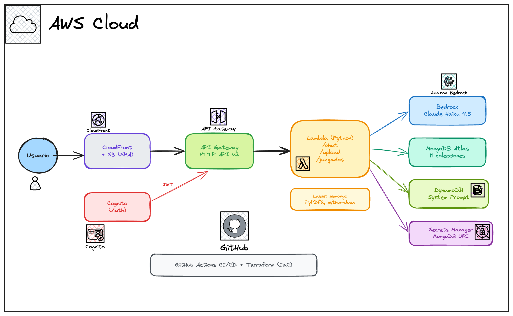

# RamaJudicialAI

Plataforma serverless de búsqueda de estados judiciales en Colombia con inteligencia artificial. Los usuarios suben documentos (PDF, DOCX, TXT), el sistema busca radicados coincidentes en la base de datos y un agente de IA (Claude Haiku 4.5) proporciona análisis contextualizado.



## Características

- **Upload multi-archivo** — Sube múltiples PDF, DOCX o TXT sin límite de cantidad
- **Búsqueda inteligente** — Extrae radicados de documentos y busca en 11 juzgados
- **Chat con IA** — Amazon Bedrock (Claude Haiku 4.5) responde consultas en lenguaje natural
- **Consulta directa a MongoDB** — El chat detecta menciones de juzgados/ciudades y muestra radicados reales
- **Autenticación** — Cognito User Pool (registro, verificación email, login con JWT)
- **System prompt dinámico** — Configurable en DynamoDB sin redesplegar
- **Dark mode** — Interfaz con tema claro/oscuro persistente
- **100% serverless** — Costo ~$0/mes en desarrollo

## Stack Tecnológico

| Capa | Tecnología |
|------|-----------|
| Frontend | HTML/CSS/JS vanilla, marked.js (markdown), CloudFront + S3 |
| API | API Gateway HTTP API v2 + JWT Authorizer |
| Compute | Lambda Python 3.12 (256MB, 30s timeout) |
| IA | Amazon Bedrock — Claude Haiku 4.5 |
| Base de datos | MongoDB Atlas (11 colecciones de juzgados) |
| Auth | Cognito User Pool (email, self sign-up) |
| Config | DynamoDB (system prompt), Secrets Manager (MongoDB URI) |
| IaC | Terraform modular |
| CI/CD | GitHub Actions (OIDC) |

## Estructura del Proyecto

```
RamaJudicialAiSolution/
├── frontend/
│   ├── index.html              # SPA principal
│   ├── app.js                  # Chat, upload, juzgados, dark mode
│   ├── auth.js                 # Flujo Cognito (login/registro/verificar)
│   ├── config.js               # Endpoints (generado por CD pipeline)
│   └── styles.css
├── backend/
│   └── lambda/
│       └── handler.py          # Handler: /chat, /upload, /juzgados, /health
├── infrastructure/
│   ├── modules/
│   │   ├── s3-frontend/        # Bucket privado + encryption
│   │   ├── cloudfront/         # CDN + OAC + security headers
│   │   ├── api-gateway/        # HTTP API v2 + JWT authorizer
│   │   ├── lambda/             # Function + Layer + IAM
│   │   ├── dynamodb/           # Agent config table
│   │   ├── cognito/            # User Pool + Client
│   │   └── secrets/            # Secrets Manager
│   ├── main.tf                 # Orquestador
│   ├── providers.tf            # AWS provider + S3 backend
│   ├── variables.tf
│   └── outputs.tf
└── .github/workflows/
    └── deploy.yml              # Pipeline unificado CI → CD
```

## API Endpoints

| Método | Path | Auth | Descripción |
|--------|------|------|-------------|
| GET | `/api/health` | No | Health check |
| GET | `/api/juzgados` | JWT | Lista de juzgados disponibles |
| POST | `/api/chat` | JWT | Chat con IA (soporta contexto MongoDB) |
| POST | `/api/upload` | JWT | Upload multi-archivo + búsqueda radicados |

### Ejemplo de uso

```bash
# Obtener token
TOKEN=$(aws cognito-idp initiate-auth \
  --client-id 3gjssnrg6e07266sfibvffqlga \
  --auth-flow USER_PASSWORD_AUTH \
  --auth-parameters USERNAME=user@email.com,PASSWORD=pass \
  --query 'AuthenticationResult.IdToken' --output text)

# Chat
curl -X POST https://8q2bno5j47.execute-api.us-east-1.amazonaws.com/api/chat \
  -H "Authorization: Bearer $TOKEN" \
  -H "Content-Type: application/json" \
  -d '{"message": "muéstrame los radicados del juzgado 1 de Ipiales"}'

# Upload (base64)
curl -X POST https://8q2bno5j47.execute-api.us-east-1.amazonaws.com/api/upload \
  -H "Authorization: Bearer $TOKEN" \
  -H "Content-Type: application/json" \
  -d '{"files": [{"file": "<base64>", "filename": "doc.pdf"}], "juzgado": "J1CMIPIALES"}'
```

## URLs Desplegadas

| Recurso | URL |
|---------|-----|
| App | https://d3fib2d1qj37tw.cloudfront.net |
| API | https://8q2bno5j47.execute-api.us-east-1.amazonaws.com/api |

## Pipeline CI/CD

```
Push a trunk / PR / workflow_dispatch
         │
         ▼
┌─────────────────────┐
│  Validate & Plan    │  ← fmt, validate, plan, package lambda + layer
└────────┬────────────┘
         │
         ▼
┌─────────────────────┐
│  ⏸️  Approval        │  ← environment 'production'
└────────┬────────────┘
         │
         ▼
┌─────────────────────┐
│  CD: Deploy         │  ← terraform apply, generate config.js, s3 sync, invalidate CF
└─────────────────────┘
```

En PRs solo corre validación + plan (sin deploy).

## Deploy Local

```bash
# 1. Auth AWS
eval "$(aws configure export-credentials --profile admindev --format env)"

# 2. Infraestructura
cd infrastructure
terraform init
terraform plan
terraform apply

# 3. Frontend
aws s3 sync frontend/ s3://$(terraform output -raw s3_bucket_id)/ --delete
aws cloudfront create-invalidation --distribution-id $(terraform output -raw cloudfront_distribution_id) --paths "/*"
```

## Costos

| Servicio | Free Tier | Costo en producción |
|----------|-----------|-------------------|
| CloudFront | 1 TB/mes | ~$0.085/GB extra |
| S3 | 5 GB | ~$0.023/GB |
| Lambda | 1M req/mes | ~$0.20/1M req |
| API Gateway | 1M req/mes | ~$1.00/1M req |
| Bedrock (Haiku) | — | ~$0.25/1M input tokens |
| Cognito | 50k MAU | $0 |
| DynamoDB | 25 GB + 25 WCU/RCU | $0 |
| Secrets Manager | — | $0.40/secret/mes |
| **Total desarrollo** | — | **~$0.40/mes** |

## Requisitos

- Terraform >= 1.5
- AWS CLI v2
- Python 3.12
- GitHub repo con OIDC configurado para `GitHubActionsDeployRole`

## MongoDB Atlas

- Cluster: `clusterestados.iarfl.mongodb.net`
- Database: `dbestados`
- Colecciones: J1CMIPIALES, J2CMIPIALES, J1PF, J2PF, J7FCALI, JPMCONTADERO, JPMCORDOBA, JPMCUMBAL, JPMGUACHUCAL, JPMPOTOSI, JPMPUPIALES
- Schema: `{ numero, ano_estado, relacion, tipo, radicado }`

## Roadmap

- [ ] Historial de conversaciones por usuario (DynamoDB)
- [ ] Dominio propio (Route53 + ACM)
- [ ] Rate limiting en API Gateway
- [ ] CloudWatch Alarms (errores, latencia)
- [ ] Tests unitarios + integración
- [ ] Ambientes separados (dev/prod)
